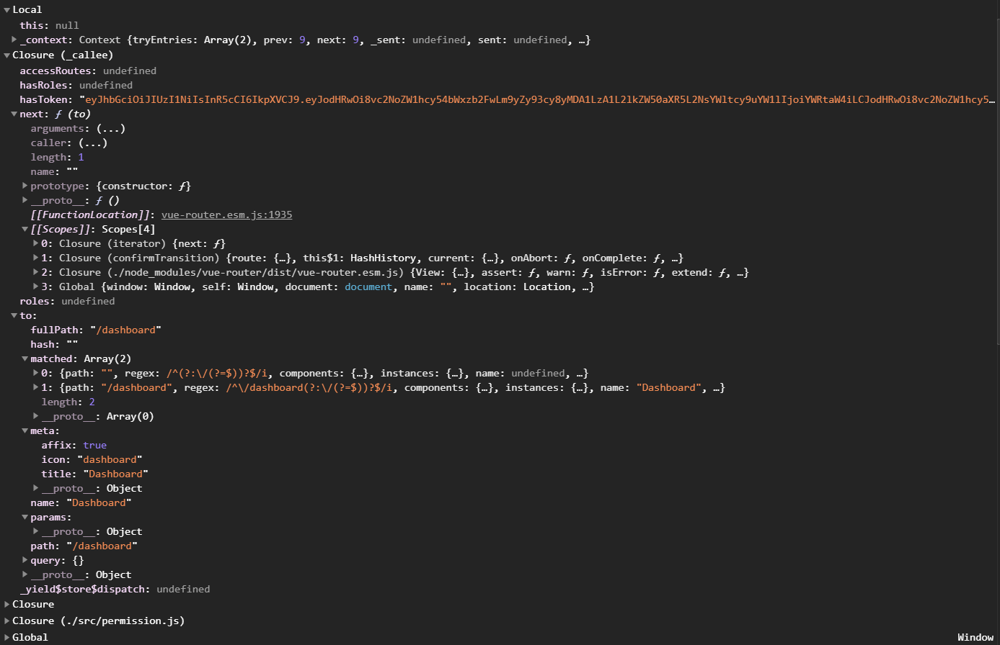

### 1. 深浅拷贝

之前一直没用到过深拷贝，今天突然发现可能今后会有这个需求，所以来搞一下：

本质区别：是否真正获取一个 *对象的复制体* 

<span font-size ="15">是</span> 获取*对象的复制体*  ? *浅拷贝* : *深拷贝*

*浅拷贝* 是同时改变的

```javascript
var obj = [0, 1, 2, 3];
var newObj = obj;
newObj[0] = 1;
console.log(obj[0]); //1
console.log(newObj[0]); // 1
```


*深拷贝* 是改变新值不改变原值

```javascript
function deepClone(obj)
{
    var newObj = obj instanceof Array ? []:{};
    if(typeof obj !== 'object')
    {
        return obj;
    } else {
        for(var i in obj)
        {
            newObj[i] = typeof obj[i] === 'object' ? deepClone(obj[i]) :
            obj[i];
        }
    }
    return newObj;
}
 
var a = [1, 2, 4, 6, "a", "12", [1, 2]];
var b = deepClone(a);
a[3] = 7;
console.log(a[3]); // 7
console.log(b[3]); // 6
```


### 2. `instanceof`

```javascript
function _getInstance(obj)
var newObj = obj instanceof Array ? [] : {};
```


### 3. 请求时的`OPTIONS`

就算为了解决跨域问题，但是为啥每次都是 *先以 OPTIONS* 请求，再以 *POST* 请求呢


### 4. `hasRoles`



这些个`[[scopes]]`是啥啊

这个是`Scopes[3].Global`：

_.png)