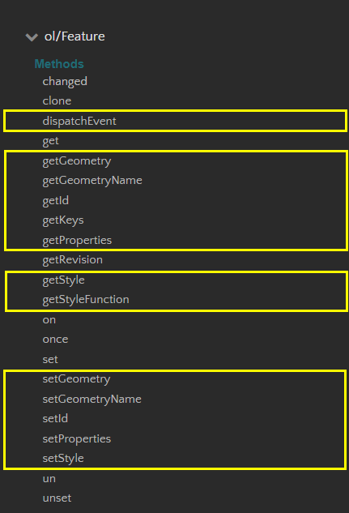
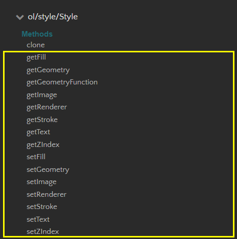

`OpenLayers` is a good stuff

Look at the [APIs][https://openlayers.org/en/latest/apidoc/]

建议多看看源码("[ol.Feature][https://github.com/openlayers/openlayers/blob/v6.5.0/src/ol/Feature.js]"的，和"[ol.style.Style][https://github.com/openlayers/openlayers/blob/v6.5.0/src/ol/style/Style.js]"的) 

Let's pick up the ones 在项目中用的最多的:

### 1. `ol.Feature`

用的多的`function`: `setStyle` & `getStyle`

### 2. `ol.Style`

geometry表示坐标及其特征

还可以添加`image`

